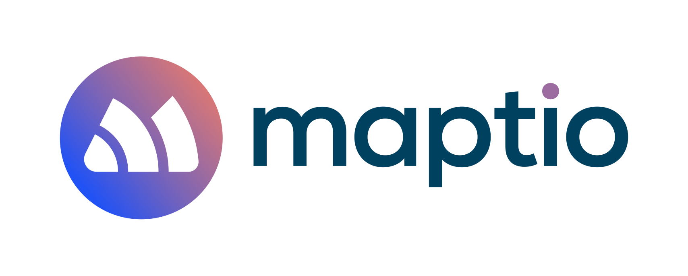

# Maptio

For founders of purpose-driven companies and initiatives who want to create a
scalable, autonomous and focussed organisation structure and culture. Our
simple online initiative mapping tool visualises who has taken responsibility
for what and who is helping who to meet those responsibilities, so that people
throughout the organisation can:

- make autonomous decisions while at the same time supporting the autonomy of
  others, all the way up to the founder holding the overall vision
- see how responsibilities throughout the organisation feed into the greater
  system
- enjoy greater transparency
- avoid the tyranny of heavy-weight processes, bureaucracy and excessive
  management.

## Introduction

| Maptio has recently become an open source project 🎉 <br><br> The below documentation has served us internally for a while, but we need to improve it. In the meantime, if you want to get started, [get in touch with us](mailto:support@maptio.com) or [with me directly](mailto:roman.goj@gmail.com) and we'll be happy to help you via a video call. <br><br> In addition to this README, you can also check out [this issue where we discuss some issues with setting up locally](https://github.com/Maptio/maptio/issues/811). Please don't forget to add your thumbs up to it, so that we know to prioritise making this easier! |
| --------------------------------------------------------------------------------------------------------------------------------------------------------------------------------------------------------------------------------------------------------------------------------------------------------------------------------------------------------------------------------------------------------------------------------------------------------------------------------------------------------------------------------------------------------------------------------------------------------------------------------------- |

## Installing / Getting started

The latest version of the app is running at
[https://app.maptio.com](https://app.maptio.com).

To launch it on your local server, see the
[Local development](#local-development) section.

## Developing

### Built With

- Angular
- Bootstrap
- D3
- Express
- MongoDB

Additionally , we use these services/packages :

- Auth0 for authentication as a service
- Intercom for chat and customer support
- Cloudinary for image storage/retrieval

### Prerequisites

You must have [Node.js](https://nodejs.org/en/download/) and
[MongoDB (Community Edition)](https://docs.mongodb.com/manual/installation/)
installed (unless you a cloud-based service).

### Local Development

#### 1. Get the code

```shell
git clone https://github.com/maptio/maptio.git
cd maptio/
```

#### 2. Set up the environment variables

Unforutnately, Maptio currently relies on external services, many of which
need to be set up for the app to work. If you'd like to set the external
services up, please use the `.env.sample` template to create a `.env` file
in the root folder and use the environment variables there as a guide for what
services to set up and what environment variables to obtain from them.

We're aware that this makes setting up Maptio for local development difficult
and we're gradually working on improving this. We've recently created a guide
for setting up Auth0 - see the next step - but more work is needed to replace
our dependencies on non-open-source services and to make setting up easier.
All help is very much welcome! Please see
[#811](https://github.com/Maptio/maptio/issues/811) for a discussion and to
share your thoughts.

#### 3. Set up Auth0

To set up Auth0, you'll need to create an account and set up a new application.
You can follow the instructions in the
[Auth0 setup guide](https://auth0.com/docs/quickstart/spa/angular/01-login).
Once you've set up the application, you'll need to add the following environment
variables to your `.env` file:

```shell
AUTH0_DOMAIN=<YOUR_AUTH0_DOMAIN>
AUTH0_CLIENT_ID=<YOUR_AUTH0_CLIENT_ID>
AUTH0_AUDIENCE=<YOUR_AUTH0_AUDIENCE>
```

You'll also need to set up the callback URLs and logout URLs in the Auth0
dashboard. For local development, you can use the following URLs:

- Callback URL: `http://localhost:4200/callback`
- Logout URL: `http://localhost:4200`

#### 4. Set up a local database

To keep your data locally, create a new folder in the root of the repository
called `local_data` and run the MongoDB demon pointing it to that folder:

```shell
mongod --dbpath=./local_data/
```

Next, point the app at the database by commenting out the `MONGODB_URI`
environment variable and pointing to your new database, e.g.:

```shell
#MONGODB_URI=mongodb://<PRODUCTION URI>
MONGODB_URI=mongodb://localhost:27017/maptio
```

#### 5. Install dependencies and start the Node.js server

```shell
npm install
npm start
```

#### 6. Check that the application is running correctly

Go to `http://localhost:4200` to see it in the browser.

#### 7. Troubleshooting

Here are some early tips for troubleshooting:

- If you're trying to set Auth0 up and have gotten to the stage where clicking
  on "log in" locally redirects you to your own Auth0 tenant (check the URL),
  but when you're redirected back to Maptio, you're still not logged in, it
  might be worth checking Auth0 logs for any errors in the configuration.
